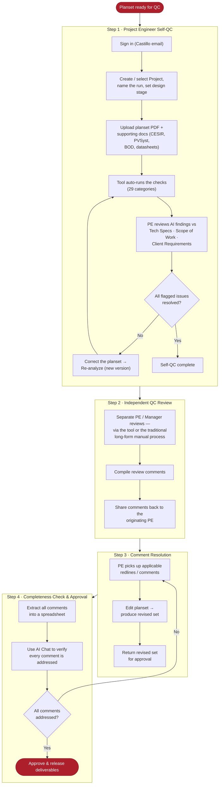

# Castillo Planset QC Tool — User Guide

*AI-assisted quality control for solar PV plansets. Web-hosted, Castillo sign-in required.*

---

## 1. What this tool is

The **Planset QC Tool** is an internal, web-hosted application that automatically reviews a
solar PV planset against Castillo's engineering rules and flags issues for a Project Engineer
(PE) to resolve. It runs **~200+ automated checks across 29 sheet categories**[^checks],
reads values out of the drawings (text *and* diagrams), cross-checks values between pages, and
lets you attach supporting documents (CESIR, PVSyst, BOD, datasheets) so findings are grounded
in the project's own data.

It is a **first-pass accelerator for self-QC and review** — it does not replace engineering
judgment or a stamped review. Every finding is a prompt for a human to confirm, correct, or
override.

[^checks]: The app's welcome screen advertises "≈203+ checks across 29 categories." Some
checks fire multiple times (once per affected sheet/row), so the count of individual findings
on a given planset is typically higher. *(If the official launch figure should read "600+",
update this line and §10.1.)*

---

## 2. The QC process at a glance

The tool supports the standard four-step Castillo QC workflow. The PE drives Steps 1, 3, and 4;
an independent reviewer (a separate PE or a Manager) drives Step 2.

| Step | Owner | Tool's role |
|---|---|---|
| **1 — Self-QC** | Project Engineer | Run the planset through the tool; review and resolve AI findings before advancing |
| **2 — Independent Review** | Separate PE / Manager | Optional — reviewer may run the tool *or* use the long-form manual process; comments compiled and returned |
| **3 — Comment Resolution** | Project Engineer | Re-analyze the revised set; compare versions to confirm fixes |
| **4 — Completeness & Approval** | Project Engineer | Export findings to Excel; use AI Chat to confirm completeness; approve |

---

## 3. Getting started

### 3.1 Sign in
- Open the tool's URL in a browser. You'll be redirected to **Microsoft sign-in** — use your
  **Castillo email**. Access is limited to the Castillo organization; no separate account or
  password is created.
- After signing in, your account appears as a **profile chip in the top-right corner**. Click
  it to see your email and to **Sign out**.
- Your identity is recorded automatically on every run you create (shown as *"by &lt;you&gt;"*),
  so the team can see who ran each QC.

### 3.2 Layout
- **Left sidebar** — the upload form, an **🗂 All Projects** button, and a **Recent** quick-switcher.
- **Main area** — the **Projects dashboard** (default) or, when you open a run, the review view.

---

## 4. Step 1 — Project Engineer Self-QC

### 4.1 Start a run (upload form, left sidebar)
1. **Your name** — auto-filled from your sign-in; records who ran the QC.
2. **Project** — type a project name, or reuse an existing one (start typing to pick from the
   list) so this run joins that project.
3. **Run name** *(optional)* — a friendly label for this run (e.g. *"Initial 60% review"*).
   If blank, the PDF filename is used.
4. **Planset PDF** — drag-and-drop or click the dropzone to choose the planset (one PDF).
5. **Design stage** — leave on **"Auto-detect from title block"** (the tool reads 30 / 60 / 90 /
   IFC / As-Built from the drawings) or set it manually. Rules that require a later stage are
   deferred (shown as *Deferred / N-A*) unless that sheet is actually present.
6. **Deep mode** *(default on)* — heavy-reasoning checks (single-line, DC, three-line,
   cross-sheet) use the full AI model; the rest use a faster, cheaper model. Turn off for a
   quicker, lighter pass.
7. **Supporting documents** *(optional but recommended)* — drop CESIR, PVSyst, ampacity tables,
   equipment datasheets, specs, etc. Each is parsed into a tagged evidence chip the AI can cite.
8. **Fill Project Details** *(optional)* — opens a structured form of known values (module,
   inverter, transformer, utility/POI, design temps, …). The AI compares these against the
   planset and flags mismatches. You can **auto-fill** it by dropping project documents into its
   uploader (it only fills blanks — it never overwrites what you typed).
9. Click **Analyze PDF**. A progress bar tracks the run; when it finishes, the new run opens.

### 4.2 Review the findings
The run view opens with:
- **Score cards** — Total Checks, Actual Checks (Deferred excluded), Pass / Fail / Review counts,
  Pages, and a Completion (pass-rate) figure.
- **Category navigation** — all 29 categories with per-category **Fail / Needs-Review / Pass /
  Deferred** counts. Click a category to filter the list.
- **Findings list** — each finding shows its status, severity, page, AI evidence, and (when
  available) a page preview with the relevant region highlighted. Tools above the list let you
  **filter by status**, **sort**, and **group repeated findings** of the same rule.

For each finding, review it **against the Tech Specs, Scope of Work, and Client Requirements**,
then:
- **Set its status** with the quick buttons — e.g. mark it **Pass**, **Needs Review**, or
  **Overridden / Accepted by QC** (with a note) when the AI is wrong or the item is acceptable.
- **Add a manual finding** the tool missed via **+ Add Issue**.
- **Report a problem** on any finding (wrong status, wrong page, wrong reason, …) — this trains
  the tool's accuracy over time.

Correct your planset for anything real, then **Re-analyze** (§4.3) and repeat until the flagged
issues are resolved. Advance to Step 2 only when your self-QC is clean.

### 4.3 Re-analyze keeps history
Clicking **↻ Re-analyze** (in the run header or on a dashboard card) runs the tool again and
saves the result as a **new version** — your previous run is **kept**, not overwritten. This
lets you show the before/after of your own corrections.

---

## 5. The Projects dashboard

Click **🗂 All Projects** (sidebar) for the dashboard — one **card per project**:
- Cards are **collapsed** by default to a compact summary (stage badge + latest Pass/Fail/Review
  counts). Click a card header to **expand** it; use **Expand all / Collapse all** at the top.
- Inside a card, each design stage (30 / 60 / 90 / IFC / As-Built) lists its run(s), each with
  **Rename**, **↻ Re-analyze**, and **Delete**, plus an expandable **version history**.
- The **Recent** list in the sidebar is a quick-switcher to jump straight to a run.

This is where Step 1's stage progression and re-analysis history live for a project.

---

## 6. Step 2 — Independent QC Review

A **separate** Project Engineer or a Manager reviews the planset. They may:
- **Use the tool** — open the same project (everyone signed in sees all projects/runs), or run
  their own analysis, and review the findings; or
- **Use the traditional long-form manual process**.

The reviewer **compiles their comments** and **shares them back** with the originating PE
(outside the tool — e.g. redlines + a comment list). The tool's role here is to give the reviewer
the same evidence-grounded findings and the project history to review against.

---

## 7. Step 3 — Comment Resolution

The originating PE:
1. Receives the review comments and **picks up the applicable redlines/comments**.
2. **Edits the planset** and produces a **revised set**.
3. Uploads the revised set — **Re-analyze** the existing run (keeps it as a new version under the
   same project/stage) or upload it as a new run in the same project.
4. Returns the revised set for approval.

> **Tip — confirm your fixes.** Open the revised run, click **Compare with…** at the top of the
> findings list, and pick the prior run. The tool shows a **Fixed / New / Drift / Removed** diff
> so you can confirm the issues you intended to fix are resolved and nothing new was introduced.

---

## 8. Step 4 — Completeness Check & Approval

1. **Export to Excel** — from the run header, click **Export Excel** for a workbook of all
   findings (Category, Item, Status, Severity, Page, Confidence, Evidence, Description, Location,
   Source citation, QC notes). Combine this with the reviewer's comment list.
2. **Extract all comments into a spreadsheet** (the export above is a ready starting point).
3. **Use AI Chat (Claude)** to verify completeness — paste the comment list and the revised-set
   status and confirm **every comment has been addressed**.
4. Once confirmed complete, **approve the deliverables for release**.

---

## 9. Rate the run (continuous improvement)

After triaging a run, the **"How was this run?"** banner lets you mark whether the tool
**saved time / was about even / cost time**, with an optional note. This feedback — together
with the per-finding "report a problem" tags — is how we tune accuracy. Please use it.

---

## 10. Reference

### 10.1 What the tool checks (29 categories)
Drawing Index · Title Block · Cover Sheet · System Information Table · General Notes · Site Plan ·
Pole Line Up · Engineered Equipment List · AC Single Line Diagram · DC Line Diagram ·
Three Line Diagram · Relay and Inverter Settings · AUX SLD · Communication Diagram · Feeder Plan ·
Communication Feeder Plan · Equipment Area Feeder Plan · Electrical Sheet · Inverter Zone Map ·
Elevation Details · Trenching Details · Overall Site Grounding Plan · Grounding Diagram ·
CAB or Cable Hanger Details · PAD / Slab Details · Pole Details · Labels · PVSyst Analysis Summary ·
**Cross-Sheet Consistency**.

The **Cross-Sheet Consistency** category is special: it checks that the *same* engineering value
(pole/pile spacing, voltages, equipment counts, FLA, transformer ratings, …) agrees wherever it
appears across the set — flagging, for example, a value shown one way on a single-line diagram
and differently on a detail sheet.

### 10.2 Supporting document types
PVSyst reports · ampacity tables · equipment datasheets · interconnection / CESIR documents ·
specifications · and general project documents (emails, agreements, submittals) for
project-detail auto-fill. Accepted file types include PDF, XLSX/XLS, CSV, TXT, EML/MSG, and
images (PNG/JPG).

### 10.3 Design stages
`30%`, `60% / IFP`, `90%`, `IFC`, `As-Built` — or **Auto-detect**. Setting the stage defers
checks that require later-stage sheets so you aren't flagged for work that isn't due yet.

### 10.4 Good habits
- **Reuse the exact project name** so runs group under one project.
- **Attach supporting docs** — they turn "can't verify" deferrals into real Pass/Fail results.
- **Re-analyze rather than re-upload** when iterating, so the version history stays intact.
- The tool is an **assistant** — always confirm a finding before acting on it; mark false
  positives as *Overridden / Accepted by QC* with a note.

---

*Questions or a finding that looks wrong? Use the in-app "report a problem" on the finding, or
contact the tool owner.*
